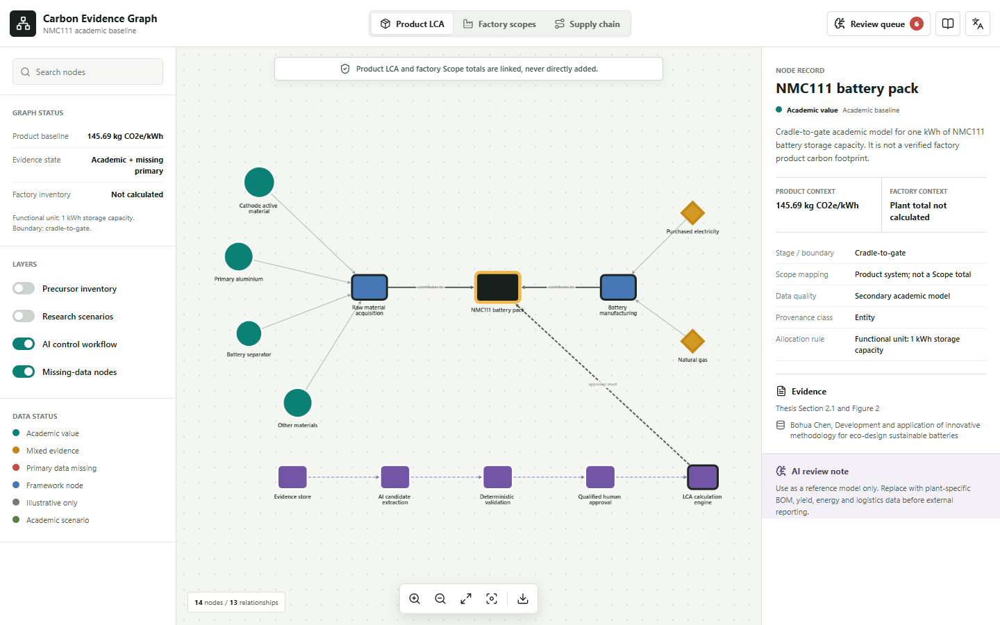

# Battery Carbon Evidence Graph

An interactive, bilingual prototype that connects battery product life-cycle assessment (LCA), factory Scope 1/2/3 inventories, supply-chain data exchange, and auditable AI-assisted evidence processing in one knowledge graph.

> Research prototype only. It is not a verified corporate greenhouse-gas inventory, regulated battery declaration, or certified product carbon footprint.



## What it demonstrates

- An NMC111 cradle-to-gate product model with a `1 kWh` functional unit.
- Separate product, factory, and supply-chain graph views.
- Shared activities such as electricity represented in both product and factory contexts without double counting.
- Evidence provenance, validation rules, human approval, and unresolved audit items.
- A constrained role for AI: extract and map candidate data, never invent or silently approve values.
- English and Chinese interface text, responsive layouts, filters, search, and JSON export.

## Run locally

Requirements: Node.js 20+ and pnpm.

```powershell
pnpm install
pnpm run dev
```

Open `http://127.0.0.1:4173`.

The project uses a small local CommonJS browser bundler rather than a framework-specific development server. Runtime assets are served locally, with no CDN dependency.

## Build

```powershell
pnpm run build
```

The browser bundle is written to `dist/app.bundle.js`.

## Optional visual verification

The Playwright script checks desktop and mobile layouts, graph rendering, tab changes, and the review queue. Install Playwright and its Chromium browser before running it:

```powershell
pnpm add --save-dev playwright
pnpm exec playwright install chromium
node scripts/verify.mjs
```

`PLAYWRIGHT_PACKAGE` and `PLAYWRIGHT_EXECUTABLE_PATH` may be set when Playwright or the browser is provided by another local runtime.

## Evidence boundary

The academic baseline uses an NMC111 cradle-to-gate study supplied by the project author. The original paper is not redistributed in this repository. The graph records only the evidence needed for the demonstration, including:

- a `1 kWh` NMC111 storage-capacity functional unit;
- a cradle-to-gate boundary;
- a baseline result of `145.69 kg CO2e/kWh`;
- selected component, electricity, and natural-gas contributions;
- recycled-aluminium, wind-electricity, and combined academic scenarios.

The source study does not explicitly provide the complete battery mass bill of materials needed to scale every precursor flow to the functional unit. The interface marks this as an open audit item and does not infer the missing value.

No real plant annual activity data are included. Factory Scope values remain missing rather than being estimated.

## Graph semantics

1. Product component burdens contribute to the product result.
2. Factory activities are classified under Scope 1, Scope 2, or Scope 3.
3. Shared activities retain distinct product and factory contexts.
4. Supplier records can be exchanged without automatically changing an approved LCA result.
5. Evidence and AI suggestions pass through deterministic rules and qualified human approval before calculation.

Product and organization totals are linked through typed allocation and provenance relationships, but are never directly added together.

## AI boundary

AI may extract candidate fields, map terminology, link evidence, and flag missing or conflicting information. It may not:

- invent missing values;
- silently choose an emission factor;
- change the functional unit, system boundary, or allocation method;
- certify a carbon footprint;
- modify an approved result without a recorded review.

## Project structure

```text
src/data.cjs        Graph records, evidence metadata, and audit findings
src/app.cjs         React interface and Cytoscape interactions
src/styles.css      Responsive visual system
scripts/build.mjs   Local CommonJS browser bundler
scripts/serve.mjs   Local static HTTP server
scripts/verify.mjs  Optional Playwright visual and interaction checks
DATA_MODEL.md       Entity and relationship design notes
```

## Referenced frameworks

- GHG Protocol Corporate Standard
- T/CQAE 12002-2024 for lithium-ion battery product carbon footprints
- EU Regulation 2023/1542 on batteries
- PACT technical specifications for product carbon-footprint exchange
- W3C PROV-O provenance ontology

External standards and source materials remain subject to their respective owners' terms. The MIT license applies to the code and original repository documentation.

## 中文简介

本项目是一个中英文交互式研究原型，将电池产品生命周期评价、工厂 Scope 1/2/3 盘查、供应链数据交换和可追溯的 AI 辅助数据处理连接到同一张知识图谱中。

AI 在本项目中只负责提取候选字段、术语映射、证据关联以及缺失或冲突提示。缺失数据不会被自动填补，排放因子、系统边界、分配方法和最终结果必须经过规则校验与人工审核。仓库不包含真实工厂年度数据，也不随代码分发原始论文。

## License

Released under the [MIT License](LICENSE).
